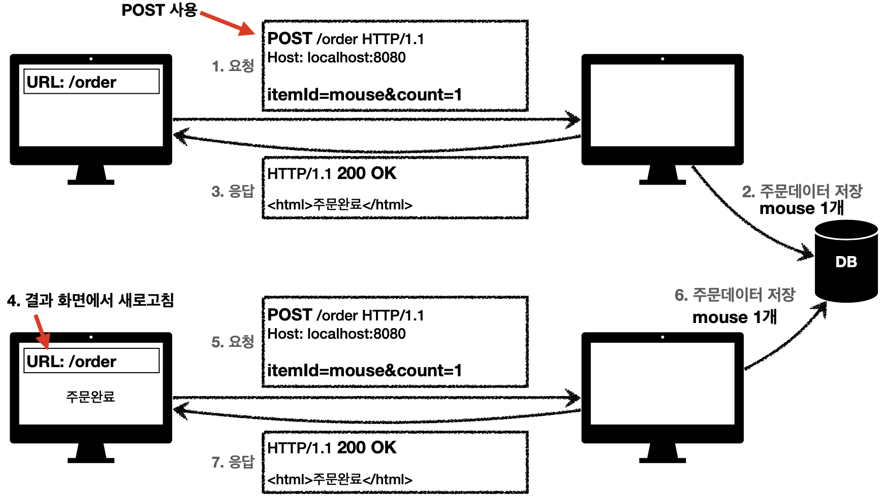
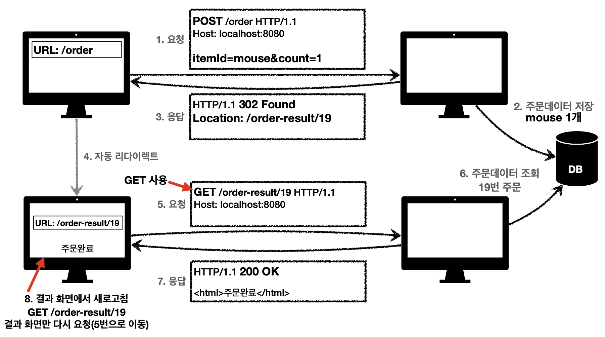

# 모든 개발자를 위한 HTTP 웹 기본 지식

"[모든 개발자를 위한 HTTP 웹 기본 지식](https://www.inflearn.com/course/http-%EC%9B%B9-%EB%84%A4%ED%8A%B8%EC%9B%8C%ED%81%AC)" 강의를 수강하면서 배운 점들을 정리한다.

## 웹 요청 흐름

HTTP는 웹 상에서 데이터를 주고받기 위해 사용하는 애플리케이션 계층 프로토콜이다. 
HTTP는 **TCP/IP** 기반으로 동작한다.

1. 브라우저에 URL 입력
2. URL 속 도메인에 대한 IP 주소 조회 (DNS)
3. TCP 3 way handshake
4. HTTP 요청 메시지 생성
5. 소켓 라이브러리를 통해 OS 계층으로 메시지 전달
6. TCP/IP 패킷 생성 및 서버로 전송
7. 서버에서 패킷을 받고, 해당 포트로 HTTP 요청 메시지 전달
8. 서버는 요청에 대한 처리 후 HTTP 응답 메시지 생성 및 전달
9. 브라우저가 HTTP 응답 메시지를 받아서 HTML 렌더링

## HTTP의 무상태(Stateless)는 수평 확장(Scale-out)에 유리하다

HTTP의 특징 중 하나가 **무상태**(**Stateless**)이다. 무상태는 응답 서버를 쉽게 바꿀 수 있으며, 무한한 서버 증설이 가능하게 한다.

모든 것은 무상태로 설계할 수 없을 수도 있다. 로그인같은 경우에 상태를 유지해야하는데, 상태 유지는 최소한으로 하고 꼭 필요한 경우에만 사용한다.

## HTTP의 비연결성(Connectionless)은 서버 자원을 효율적으로 사용하게 한다

연결을 유지하고 있으면 그만큼 서버의 자원이 소모된다. 따라서, 요청/응답이 종료되면 연결을 끊어버린다.

하지만 수많은 자원이 다운로드 되는데, 이러한 요청마다 매번 연결을 맺고 끊으면 그만큼 TCP 3-way-handshake 시간이 추가될 것이다.  
지금은 HTTP 지속 연결(**Persistent Connection**)을 이용해 문제를 해결했다.

## HTTP 메시지 공식 스펙은

```text
 HTTP-message   = start-line
                  *( header-field CRLF )
                  CRLF
                  [ message-body ]
```

단순한 구조이다. `start-line`은 요청이냐 응답이냐에 따라 `request-line`이거나 `status-line`이다.

```text
 start-line     = request-line / status-line
```

헤더에는 HTTP 전송에 필요한 모든 부가정보를 담고있다. 

이후에 공백라인(`CRLF`)를 추가하고 바디(body)는 있을 수도, 없을 수도 있다.

### `request-line`

```text
 request-line   = method SP request-target SP HTTP-version CRLF
```

- method: 서버가 수행해야 할 동작
- request-target: 경로
- HTTP-version

예시는 다음과 같다.

```text
GET /search?q=hello&hl=ko HTTP/1.1
```

### `status-line`

```text
 status-line    = HTTP-version SP status-code SP reason-phrase CRLF
```

- HTTP-version
- status-code: 요청 성공, 실패 등을 나타내는 상태 코드
- reason-phrase: 사람이 이해할 수 있는 상태 코드에 대한 짧은 글

예시는 다음과 같다.

```text
HTTP/1.1 200 OK
```

## URI는 리소스만 식별한다

리소스와 해당 리소스를 대상으로 하는 행위를 분리한다. 

URI로 리소스를 식별하고, HTTP 메서드로 행위를 결정한다.

참고로 계층 구조상 상위 컬렉션으로 보고, **복수단어** 사용을 권장한다. (`/member/1` → `/members/1`)

## POST는 단순히 등록의 의미가 아니라, 프로세스 처리를 의미한다.

HTTP 메서드 중 POST는 요청 데이터를 어떻게 처리할지 리소스마다 따로 정해야한다.

새 리소스를 생성(등록)할 수도 있고, 생성을 넘어 프로세스를 처리해야하는 경우도 POST를 사용한다. 
예를 들어, 주문에서 결제완료, 배달시작, 배달완료로 바뀌듯이 단순히 값 변경을 넘어 프로세스의 상태가 변경될 수 있다.

또한 다른 메서드로 처리하기 애매한 경우 POST를 쓰기도 한다.

## HTTP 메서드의 안전(Safety), 멱등(Idempotent), 캐시가능(Cacheable)

- **안전**은 메서드를 호출해도 리소스를 변경하지 않는 것을 의미한다.
  - GET
- **멱등**은 1번 호출하든, 100번 호출하든 결과가 같은 것을 의미한다.
  - GET, PUT, DELETE
  - 자동 복구 매커니즘에 활용할 수 있다. 예를 들어, 서버가 정상적으로 응답을 주지 못했을 때 클라이언트는 같은 요청을 다시 해도 되는지에 대한 근거가 될 수 있다.
- **캐시가능**은 응답 결과 리소스를 캐시해서 사용해도 되는지를 의미한다.
  - GET, HEAD, POST, PATCH
  - 실제로는 GET, HEAD만 사용한다. POST와 PATCH는 본문 내용까지 캐시 키로 고려해야 하는데 구현이 쉽지 않기 때문이다.

## 웹 브라우저는 3xx 응답에 `Location` 헤더가 있으면, 자동 이동한다

클라이언트 요청에 대한 응답의 상태코드가 3xx이고 헤더에 `Location` 필드가 있으면, 해당 위치로 자동으로 이동한다. 이를 **리다이렉션**(**Redirection**)이라 한다.

## 일시적인 리다이렉션은 언제 쓰는가

예를 들어, 어떤 제품을 주문해서 `POST /order` 요청을 보냈고, 서버는 응답으로 `<div>주문완료</div>`를 보냈다고 하자.
클라이언트가 주문완료 화면을 보는 상태에서 새로고침하면 어떻게 되는가?
`POST /order` 요청이 재전송 될 것이고, 서버에서 막지 않았다면 중복 주문이 들어갈 것이다.



이러한 경우 필요한 것이 일시적인 리다이렉션이다. **PRG**(POST/Redirect/GET)의 형태로 사용한다.
POST로 주문 후, 주문 결과 화면을 **GET 메서드로 리다이렉트**한다. 클라이언트에서 새로고침하더라도 GET 메서드를 새로고침하는 것이기 때문에 안전한다.



## 일시적인 리다이렉션은 주로 `302 Found`를 쓴다

- `302 Found`: 리다이렉트시 요청 메서드가 GET으로 변경하고, 본문이 제거 될 수도 있음(May)
- `307 Temporary Redirect`: 302와 같으나, 리다이렉트시 요청 메서드와 본문을 유지(Must)
- `303 See Other`: 302와 같으나 요청 메서드가 GET으로 변경

이미 많은 라이브러리들이 `302 Found`를 사용하고 있으며, 302가 GET으로 변경될 수 있다고 했지만 대부분 GET으로 변경한다.
리다이렉트시 GET으로 변해도 상관없다면 302를 사용해도 문제 없다.

## 콘텐츠 협상 (Content Negotiation)

클라이언트가 선호하는 표현을 요청한다.

- `Accept`: 클라이언트가 선호하는 미디어 타입
- `Accept-Charset`: 클라이언트가 선호하는 문자 인코딩
- `Accept-Encoding`: 클라이언트가 선호하는 압축 인코딩
- `Accept-Language`: 클라이언트가 선호하는 자연 언어

## 요청 헤더 중 `Referer`는 이전 웹페이지 주소를 나타낸다

따라서 `Referer`를 통해 **유입 경로를 분석**할 수 있다.

## 요청 헤더 중 `User-Agent`는 클라이언트 애플리케이션을 나타낸다

따라서 얼마나 많은 브라우저를 사용하는지에 대한 통계 정보나, 어떤 브라우저에서 장애가 발생하는지 파악할 수 있다.

## 요청 헤더 중 `Host`는 필수 값이다

`Host`는 요청한 호스트 정보(도메인)를 나타낸다. 하나의 IP 주소에 여러 도메인이 적용되어 있는 경우(가상 호스팅)가 있으므로 반드 필요한 값이다.

## 쿠키에 저장된 데이터는 브라우저가 자동으로 요청에 포함시킨다

브라우저가 요청을 보낼 때, 쿠키를 **자동으로 추가해서 요청을 전송**한다. 따라서, 네트워크 트래픽이 추가로 유발한다.

서버로 자동으로 전송하지 않으면서 내부에 저장하고 싶다면 **웹 스토리지**(LocalStorage, SessionStorage)를 사용한다.

## 쿠키에 만료를 지정하는 법은 `Expires`, `Max-Age`

`Expires`는 만료되는 날짜를 정하고, `Max-Age`는 만료되는 시간을 초단위로 정한다.

- `Set-Cookie: Expires=Sat, 26-Dec-2020 04:39:21 GMT`
  - 만료 일이 되면 쿠키 삭제
- `Set-Cookie: Max-Age=3600`
  - 0이나 음수를 지정하면 쿠키 삭제

만료를 생략하면 브라우저 종료시 까지 유지된다. 이를 **세션 쿠키**라 한다.

날짜를 입력하면 해당 날짜까지 유지된다. 이를 **영속 쿠키**라 한다.

## 쿠키에 보안을 설정하는 법은 `Secure`, `HttpOnly`, `SameSite`

`Secure`는 https인 경우에만 전송한다.

`HttpOnly`는 자바스크립트에서 접근이 불가하고, HTTP 전송에만 사용된다. XSS 공격을 방지한다.

`SameSite`는 요청 도메인과 쿠키에 설정된 도메인이 같은 경우에만 전송된다. CSRF 공격을 방지한다.

## 브라우저 캐시를 사용하기 위해, 검증 헤더와 조건부 요청이 있어야 한다

서버는 요청에 대해서 응답 헤더 중 `Cache-Control`의 `Max-Age`를 설정해서 데이터를 캐싱할 수 있다.

캐시 만료 후에도 서버에서 데이터를 변경하지 않으면, 저장되어 있던 캐시를 재사용할 수 있다. 대신 클라이언트 데이터와 서버의 데이터가 같다는 사실을 확인해야한다.

### `Last-Modified`와 `If-Modified-Since`

서버의 응답 헤더 중 `Last-Modified`를 추가하여 **데이터가 마지막에 수정된 시간**을 알려준다. 클라이언트는 캐시에 저장할 때 함께 저장한다.

캐시 만료 후, 클라이언트의 요청 헤더 중 `If-Modified-Since`를 추가하여 캐시된 데이터가 수정된 적 있는 지 확인한다.

만약 최종 수정일을 확인했는데 바뀌지 않았다면, 서버는 `304 Not Modfied` 응답을 보낸다. 여기에는 HTTP Body가 없다. 클라이언트는 있던 캐시를 재사용하고 `Cache-Control`에 따라 만료 시간을 재설정한다.

만약 바뀌었다면, 서버는 `200 OK` 응답과 함께 데이터를 함께 보낸다. 여기에는 HTTP Body가 포함된다.

### `ETag`와 `If-None-Match`

`Last-Modified` 방식으로는 데이터를 수정해서 최종 수정일이 바뀌었지만 데이터가 결과가 그대로인 경우를 캐시할 수 없다.

ETag(Entity Tag)는 캐시용 데이터에 임의의 고유한 이름(버전, 해시값 등)을 붙이는 것이다. 데이터가 변경되면 이 이름을 변경하는 것이다. 따라서 단순하게 **ETag가 같으면 유지하고, 다르면 다시 다운받는다.**

서버의 응답 헤더 중 `ETag`를 추가하여 고유한 이름을 붙인다. 클라이언트는 캐시에 저장할 때 함께 저장한다.

캐시 만료 후, 클라이언트 요청 헤더 중 `If-None-Match`를 추가하여 캐시된 데이터가 바뀌었는지 확인한다.

만약 ETag가 동일하면 바뀌지 않았으므로, 서버는 `304 Not Modified` 응답을 보낸다. 여기에는 HTTP Body가 없다. 클라이언트는 있던 캐시를 재사용하고 `Cache-Control`에 따라 만료 시간을 재설정한다.

만약 ETag가 다르면, 서버는 `200 OK` 응답과 함께 데이터를 함께 보낸다. 여기에는 HTTP Body가 포함된다.

**캐시 제어 로직을 서버에서 완전히 관리하고, 클라이언트는 캐시 매커니즘을 모른다**는 장점이 있다.

## 확실하게 캐시를 무효화하려면, `Cache-Control: no-cache, no-store, must-revalidate`

서버의 응답 헤더에 `Cache-Control: no-cache, no-store, must-revalidate`를 추가하여 캐시를 무효화할 수 있다. `Pragma: no-cache`도 추가하면 HTTP 1.0 하위 호환할 수 있다.

- `no-cache`: 데이터는 캐시해도 되지만, 항상 원(origin) 서버에 검증하고 사용
- `no-store`: 메모리에서 사용하고 최대한 빨리 삭제
- `must-revalidate`: 캐시 만료 후 최초 조회시 원 서버에 검증해야한다. 원 서버 접근 실패시 반드시 오류가 발생해야 한다.(`504 Gateway Timeout`) 캐시가 유효하면 캐시를 사용한다.

원(origin) 서버라고 하는 이유는 보통 프록시 캐시 서버가 존재할 수 있기 때문에, 실제 데이터를 제공하는 서버가 원 서버이다. 

`no-cache`와 `must-revalidate`가 비슷해 보인다. 둘 다 캐시 데이터를 **원 서버에게 검증한다**는 공통점이 있다.

차이점은 프록시 캐시와 원 서버의 연결이 끊어졌을 때, `no-cache`는 프록시 캐시에서 오류를 주는 대신 `200 OK`를 주는 경우가 있다고 한다. (실제 데이터는 안되지만, 오래된 데이터라도 주기 위해) 

그에 반해 `must-revalidate`는 `504 Gateway Timeout`을 준다. 
