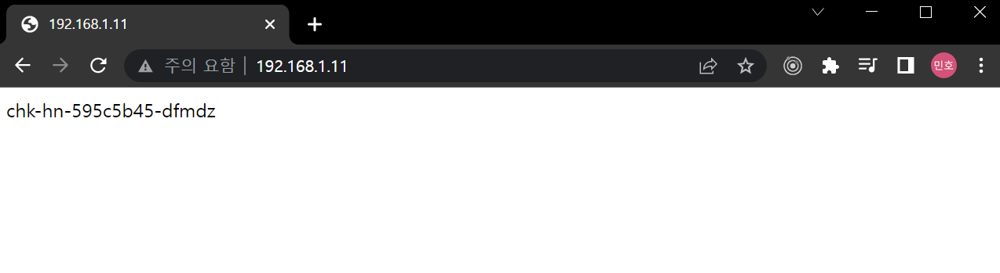
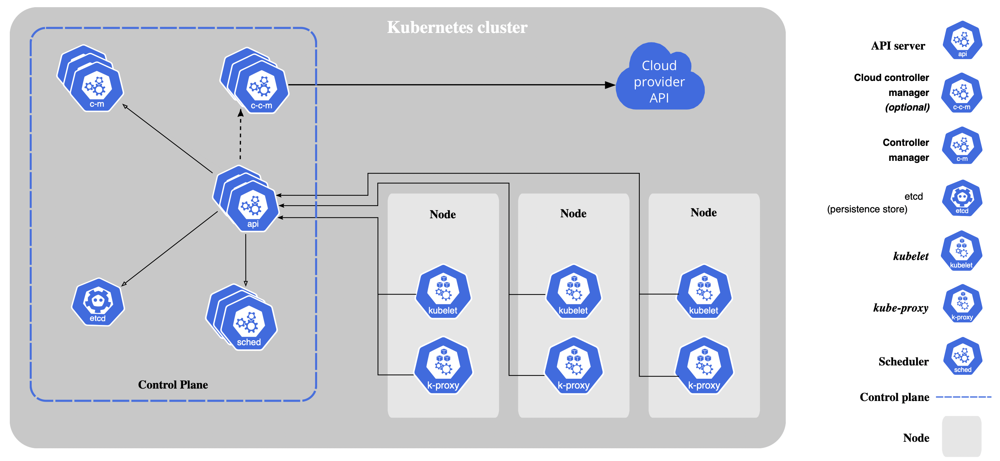
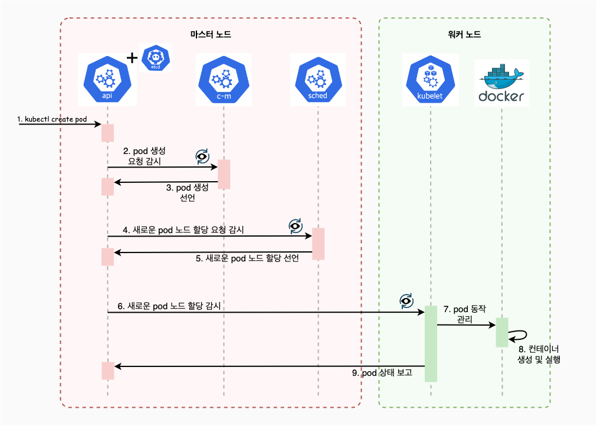

# 쉽게 시작하는 쿠버네티스(v1.25)

"[쉽게 시작하는 쿠버네티스(v1.25)](https://www.inflearn.com/course/%EC%BF%A0%EB%B2%84%EB%84%A4%ED%8B%B0%EC%8A%A4-%EC%89%BD%EA%B2%8C%EC%8B%9C%EC%9E%91)" 강의를 수강하면서 배운 점들을 정리한다.

## 쿠버네티스(Kubernetes)

**컨테이너**화된 **워크로드**와 서비스를 관리하는 도구다. 컨테이너를 **오케스트레이션**한다.

### 컨테이너(Container)

애플리케이션을 실행할 수 있는 환경이다. 격리된 공간에서 프로세스가 동작한다.

### 워크로드(Workload)

쿠버네티스에서 구동되는 애플리케이션이다.

### 오케스트레이션(Orchestration)

여러 서버에 걸친 컨테이너 및 사용 환경 설정을 관리 및 조정하는 것이다.

### 쿠버네티스 구성 방법

- 관리형 쿠버네티스: 사용자가 관리할 부분이 없고, 배포만 해놓으면 자동으로 관리가 된다.
  - AWS, Azure, GCP 등
- 설치형 쿠버네티스: 설치할 수 있도록 패키지화된다.
  - OpenShift, Rancher 등
- 구성형 쿠버네티스: 사용하는 시스템에 쿠버네티스 클러스터를 자동으로 구성해주는 솔루션이다.
  - kubeadm, kops 등

## 파드(Pod)

**컨테이너의 집합**이면서 쿠버네티스가 관리할 수 있는 최소 단위이다. 보통 하나의 파드는 하나의 컨테이너를 가진다.

## 서비스(Service)

외부에서 파드에 접속하기 위한 **문** 역할을 한다. 실행중인 애플리케이션을 네트워크 서비스로 노출한다.

아래는 nginx 파드를 배포하고, NodePort로 파드를 외부에서 접근할 수 있도록 하는 예시이다.
```shell
[root@m-k8s ~]# kubectl run nginx --image=nginx
pod/nginx created

[root@m-k8s ~]# kubectl expose pod nginx --type=NodePort --port=80
service/nginx exposed

[root@m-k8s ~]# kubectl get service
NAME         TYPE        CLUSTER-IP       EXTERNAL-IP   PORT(S)        AGE
kubernetes   ClusterIP   10.96.0.1        <none>        443/TCP        24h
nginx        NodePort    10.101.226.243   <none>        80:32515/TCP   6s

[root@m-k8s ~]# kubectl get pod -o wide
NAME    READY   STATUS    RESTARTS   AGE    IP               NODE     NOMINATED NODE   READINESS GATES
nginx   1/1     Running   0          2m4s   172.16.221.131   w1-k8s   <none>           <none>

[root@m-k8s ~]# kubectl get node -o wide
NAME     STATUS   ROLES                  AGE   VERSION   INTERNAL-IP     EXTERNAL-IP   OS-IMAGE                KERNEL-VERSION                CONTAINER-RUNTIME
m-k8s    Ready    control-plane,master   24h   v1.20.2   192.168.1.10    <none>        CentOS Linux 7 (Core)   3.10.0-1127.19.1.el7.x86_64   docker://19.3.14
w1-k8s   Ready    <none>                 24h   v1.20.2   192.168.1.101   <none>        CentOS Linux 7 (Core)   3.10.0-1127.19.1.el7.x86_64   docker://19.3.14
w2-k8s   Ready    <none>                 23h   v1.20.2   192.168.1.102   <none>        CentOS Linux 7 (Core)   3.10.0-1127.19.1.el7.x86_64   docker://19.3.14
w3-k8s   Ready    <none>                 23h   v1.20.2   192.168.1.103   <none>        CentOS Linux 7 (Core)   3.10.0-1127.19.1.el7.x86_64   docker://19.3.14
```

nginx는 `w1-k8s` 노드에 배포되었고, 그 노드의 IP 주소 `192.168.1.101`와 NodePort에서 설정된 포트 `32515`로 외부에서 접속하면, nginx 홈 화면을 볼 수 있다.

```shell
C:\Users\minho>curl 192.168.1.101:32515
<!DOCTYPE html>
<html>
<head>
<title>Welcome to nginx!</title>
<style>
html { color-scheme: light dark; }
body { width: 35em; margin: 0 auto;
font-family: Tahoma, Verdana, Arial, sans-serif; }
</style>
</head>
<body>
<h1>Welcome to nginx!</h1>
<p>If you see this page, the nginx web server is successfully installed and
working. Further configuration is required.</p>

<p>For online documentation and support please refer to
<a href="http://nginx.org/">nginx.org</a>.<br/>
Commercial support is available at
<a href="http://nginx.com/">nginx.com</a>.</p>

<p><em>Thank you for using nginx.</em></p>
</body>
</html>
```

## 디플로이먼트(Deployment)

위에서 `kubectl run nginx --image=nginx` 명령을 통해 nginx 파드 1개를 생성했었는데, 디플로이먼트를 통해 여러 개의 파드를 생성할 수 있다.

아래는 디플로이먼트를 통해 nginx 파드 1개를 생성한 후에, 3개로 늘리는 과정이다.
```bash
[root@m-k8s ~]# kubectl create deployment deploy-nginx --image=nginx
deployment.apps/deploy-nginx created

[root@m-k8s ~]# kubectl get pod -o wide
NAME                            READY   STATUS    RESTARTS   AGE    IP               NODE     NOMINATED NODE   READINESS GATES
deploy-nginx-8458f6dbbb-sxm8j   1/1     Running   0          2m4s   172.16.103.129   w2-k8s   <none>           <none>
nginx                           1/1     Running   0          30m    172.16.132.1     w3-k8s   <none>           <none>

[root@m-k8s ~]# kubectl scale deployment deploy-nginx --replicas=3
deployment.apps/deploy-nginx scaled

[root@m-k8s ~]# kubectl get pod
NAME                            READY   STATUS    RESTARTS   AGE
deploy-nginx-8458f6dbbb-7s9wr   1/1     Running   0          49s
deploy-nginx-8458f6dbbb-kdgws   1/1     Running   0          49s
deploy-nginx-8458f6dbbb-sxm8j   1/1     Running   0          6m35s
nginx                           1/1     Running   0          35m
```
레플리카를 3으로 설정하여 스케일을 조정한다. 쿠버네티스가 자동으로 파드를 3개로 만든다.

## 로드밸런서(Load Balancer)

외부에서 접근하는 방법으로 NodePort를 사용했는데, 특정 노드의 IP 주소를 알아야 하는 단점이 있다. 로드밸런서는 외부 IP 주소를 노출시키고, 여기로 접근하면 알아서 각 파드로 분배된다. 

아래는 `chk-hn`라는 애플리케이션을 파드 3개로 스케일링하고, 로드밸런서를 추가하는 예시이다.

```bash
[root@m-k8s ~]# kubectl create deployment chk-hn --image=sysnet4admin/chk-hn
deployment.apps/chk-hn created

[root@m-k8s ~]# kubectl scale deployment chk-hn --replicas=3
deployment.apps/chk-hn scaled

[root@m-k8s ~]# kubectl get pod
NAME                            READY   STATUS    RESTARTS   AGE
chk-hn-595c5b45-dfmdz           1/1     Running   0          33s
chk-hn-595c5b45-tbp2h           1/1     Running   0          33s
chk-hn-595c5b45-zs9kr           1/1     Running   0          63s

[root@m-k8s ~]# kubectl expose deployment chk-hn --type=LoadBalancer --port=80
service/chk-hn exposed

[root@m-k8s ~]# kubectl get service
NAME           TYPE           CLUSTER-IP       EXTERNAL-IP    PORT(S)        AGE
chk-hn         LoadBalancer   10.103.220.72    192.168.1.11   80:32361/TCP   33s
kubernetes     ClusterIP      10.96.0.1        <none>         443/TCP        106m
```
로드밸런서의 IP 주소인 `192.168.1.11`로 외부에서 접속하면, chk-hn 홈 화면을 볼 수 있다.



`chk-hn`은 호스트 이름을 확인할 수 있 애플리케이션으로, 위에 파드를 조회했을 때 보이는 첫 번째 파드의 이름과 동일한 것으로 보아 첫 번째 파드로 접근한 것으로 보인다. 

## 쿠버네티스의 구성요소



쿠버네티스 클러스터는 크게 마스터 노드와 워커 노드로 나뉜다.

마스터 노드는 **컨트롤 플레인**(control plane)이라고도 부르는데, API 서버, etcd, 컨트롤러 매니저, 스케줄러 4가지의 주요 구성요소가 있다.

- API 서버는 컨트롤 플레인의 중심이다. 사용자의 요청을 받는 역할을 한다. **클러스터의 업데이트된 정보를 etcd에 기록한다(백업용).**
- etcd는 저장소다. 클러스터 상태 정보, 배포된 애플리케이션 실행 정보 등을 저장한다. 안정적인 동작을 위해 데이터를 분산하여 저장한다.
- 컨트롤러 매니저는 상태를 유지하기위해 지속적으로 모니터링한다.
- 스케줄러는 파드를 어떤 노드에 배치할건지 결정한다.

워커 노드에는 kubelet, kube-proxy, 컨테이너 런타임(도커)으로 구성되어 있다.

- kubelet은 노드 내 컨테이너를 관리한다.
- kube-proxy는 클러스터 내부에서 네트워크 요청을 전달하는 역할을 한다.
- 컨테이너 런타임은 파드에 포함된 컨테이너 실행을 실질적으로 담당한다.

## 쿠버네티스의 동작

예를 들어 사용자가 `kubectl create pod`라고 명령했다면 아래와 같이 진행될 것이다.



- API 서버는 사용자로부터 명령을 받으면, 파드를 생성하겠다고 상태를 **선언**(저장)한다. 
- 컨트롤러 매니저와 스케줄러는 주기적으로 API 서버로부터 상태를 확인하고, 기존과 다르면 그 상태에 맞도록 작업한다.
- kubelet은 API 서버의 지시를 받아 파드를 생성한다. 그리고 파드의 상태를 API 서버에게 보고한다.
- 각 노드에서 kubelet은 파드의 동작을 관리하며, 실질적으로 컨테이너를 생성하는 역할은 컨테이너 런타임(도커)이 맡는다.

### 선언적인 시스템

API 서버는 상태를 가지고 있을 뿐이다. 추구하는 상태(desired state)를 선언하고, 현재 상태를 거기에 맞추려고 한다.

`감시 > 차이 발견 > 상태 변경 > 감시` 과정의 순환이다.

컨트롤러 매니저, 스케줄러는 주기적으로 API 서버의 상태를 확인하고, 차이를 발견하면 작업하여 상태를 변경한다.

## 파드가 삭제되면

만약 파드만 배포된 경우에는 난감하다.

하지만 deployment로 배포된 경우는 신경쓰지 않아도 된다. 파드가 삭제되면, deployment에 선언된대로 알아서 다시 새로운 파드가 생성되기 떄문이다.

## 워커 노드의 kubelet이 멈추면

워커 노드 1의 kubelet을 멈춘 후 deployment로 배포하면, 워커 노드 1을 할당받은 파드는 `Pending` 상태가 된다.

그리고 다시 워커 노드 1의 kubelet을 시작하자, `Pending` 상태였던 파드는 정상적으로 실행되어 동작하였다.

## 워커 노드의 컨테이너 런타임이 멈추면

기존에 어떤 애플리케이션에 대해 파드 3개가 배포되어 있다고 하자.

만약 워커 노드 1의 도커를 멈춰버리고 파드를 6개로 늘리면, 스케줄러는 워커 노드 1에 파드를 할당하지 않는다.

> kubelet이 멈췄을 때는 API 서버에게 알릴 수가 없기 때문에 단순히 `Pending` 상태에 머무르지만, 
> 컨테이너 런타임에 문제가 생기면 kubelet이 바로 API 서버에게 알려서 해당 노드에는 스케줄링 하지 않도록 한다.

다시 워커 노드1의 도커를 살리고 파드를 9개로 늘리면, 스케줄링에 따라 워커 노드1에 파드가 할당된다. 

### 워커 노드의 컨테이너 런타임이 멈춘 상태에서 파드는 어떻게 되나

파드 3개가 돌아가고 있고, 워커 노드 1의 도커를 멈췄을 때로 돌아가보자.

마스터 노드에서 확인하면 워커 노드 1의 도커가 멈췄더라도 여전히 워커 노드의 1의 파드는 `Running` 상태이다. 
하지만 해당 노드는 도커가 멈췄으므로 파드가 정상적으로 동작하지 않는다(파드에 접근할 수 없다).

문제가 생긴 노드에서 파드를 종료시키는 것을 **축출**(eviction)이라 한다. 기본값으로 축출 타임아웃은 5분이다. 
5분간 노드에 문제가 있다고 판단되는 경우 해당 노드의 파드를 종료시키고 다른 노드로 이동시킨다.

5분이 지나서 축출하려고 해도 해당 노드는 컨테이너 런타임이 멈췄으므로 파드를 삭제하려고 시도할 뿐, 파드가 삭제되지는 못할 것이다. 
하지만 다른 노드에 새로운 파드가 생성된다.

## 쿠버네티스 마스터 노드의 구성요소 확인하기

1개의 마스터 노드, 3개의 워커 노드가 있다고 하자. 쿠버네티스의 마스터 노드의 구성 요소 파드는 아래와 같이 확인할 수 있다.
```shell
[root@m-k8s ~]# kubectl get pod -n kube-system -o wide
NAME                                       READY   STATUS    RESTARTS   AGE     IP              NODE     NOMINATED NODE   READINESS GATES
calico-kube-controllers-744cfdf676-2fsgs   1/1     Running   1          7d16h   172.16.171.70   m-k8s    <none>           <none>
calico-node-dmzqp                          1/1     Running   0          7d15h   192.168.1.103   w3-k8s   <none>           <none>
calico-node-qxbpt                          1/1     Running   0          7d15h   192.168.1.102   w2-k8s   <none>           <none>
calico-node-whv2x                          1/1     Running   2          7d16h   192.168.1.101   w1-k8s   <none>           <none>
calico-node-wzkcn                          1/1     Running   1          7d16h   192.168.1.10    m-k8s    <none>           <none>
coredns-74ff55c5b-82s2b                    1/1     Running   1          7d16h   172.16.171.68   m-k8s    <none>           <none>
coredns-74ff55c5b-w47kz                    1/1     Running   1          7d16h   172.16.171.69   m-k8s    <none>           <none>
etcd-m-k8s                                 1/1     Running   1          7d16h   192.168.1.10    m-k8s    <none>           <none>
kube-apiserver-m-k8s                       1/1     Running   1          7d16h   192.168.1.10    m-k8s    <none>           <none>
kube-controller-manager-m-k8s              1/1     Running   1          7d16h   192.168.1.10    m-k8s    <none>           <none>
kube-proxy-f5ddf                           1/1     Running   0          7d15h   192.168.1.103   w3-k8s   <none>           <none>
kube-proxy-jqhkj                           1/1     Running   2          7d16h   192.168.1.101   w1-k8s   <none>           <none>
kube-proxy-wg9bm                           1/1     Running   0          7d15h   192.168.1.102   w2-k8s   <none>           <none>
kube-proxy-z2b7p                           1/1     Running   1          7d16h   192.168.1.10    m-k8s    <none>           <none>
kube-scheduler-m-k8s                       1/1     Running   1          7d16h   192.168.1.10    m-k8s    <none>           <none>
```

## 마스터 노드의 스케줄러가 삭제되면

마스터 노드에 접속해서 그냥 스케줄러 파드를 삭제하면, 다시 재생성된다.

하지만 파드를 관리하는 kubelet을 멈추고 스케줄러 파드를 삭제하면, 삭제가 수행되지 않고 `Terminating` 상태에 머무른다.
그렇더라도 이 상태에서 배포 및 스케일링은 정상적으로 작동한다.

## 마스터 노드의 도커가 멈추면

마스터 노드에 접속해서 도커를 멈추면, API 서버와의 통신이 불가하여 어떤 명령어도 할 수 없다. 또한 파드와의 통신도 불가하다.

> 마스터 노드의 kubelet은 문제가 생겨도 괜찮지만, 컨테이너 런타임에 문제가 생기면 심각해진다. 따라서 현업에서는 **멀티 마스터 노드**를 가진다.

## 볼륨 (Volume)

간단하게 마스터 노드에 디렉터리를 만들어, NFS(Network File System)로 만들고 파드들이 이를 볼륨으로 사용할 수 있도록 할 수 있다.

예를 들면, 배포 설정 yaml 파일에서 아래와 같은 설정으로 NFS 볼륨을 사용할 수 있다. 
마스터 노드 `192.168.1.10`의 디렉터리 `/nfs_shared/log`를 볼륨으로 하고, 컨테이너 내에 `/audit`에 마운트 될 것이다.
```yaml
apiVersion: apps/v1
kind: Deployment
metadata:
  name: dpy-chk-log
spec:
  replicas: 3
  selector:
    matchLabels:
      app: dpy-chk-log
  template:
    metadata:
      labels:
        app: dpy-chk-log
    spec:
      containers:
      - name: dpy-chk-log
        image: sysnet4admin/chk-log
        volumeMounts:
        - name: nfs-vol
          mountPath: /audit
      volumes:
      - name: nfs-vol
        nfs:
          server: 192.168.1.10
          path: /nfs_shared/log
```

볼륨은 영속적이므로, 파드를 지우고 다시 생성해도 그대로 유지된다.
