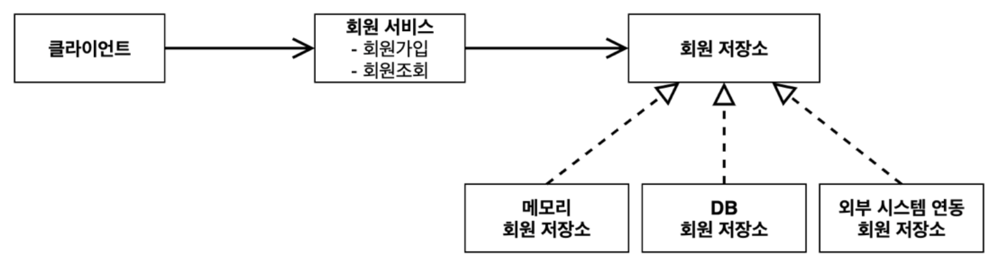
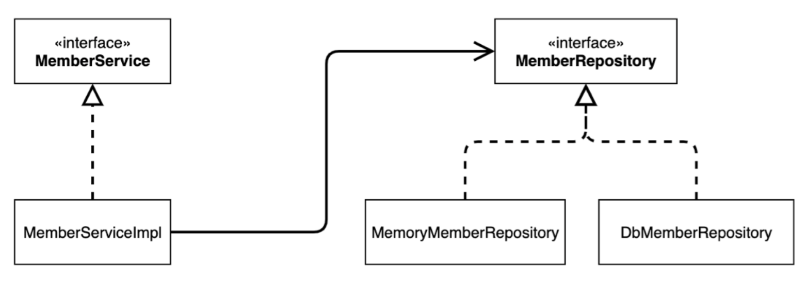
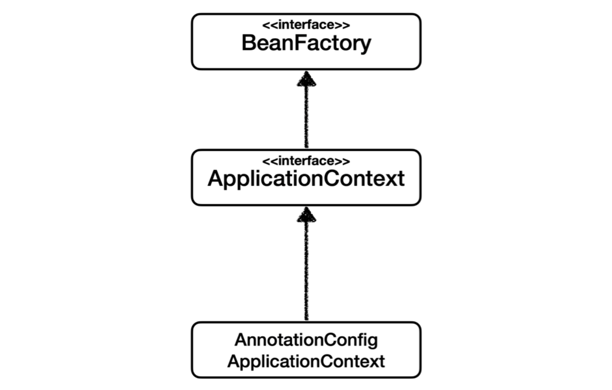

# 스프링 핵심 원리 - 기본편

"[스프링 핵심 원리 - 기본편](https://www.inflearn.com/course/%EC%8A%A4%ED%94%84%EB%A7%81-%ED%95%B5%EC%8B%AC-%EC%9B%90%EB%A6%AC-%EA%B8%B0%EB%B3%B8%ED%8E%B8)" 강의를 수강하면서 배운 점들을 정리한다.

## 스프링 부트의 장점은

- 단독으로 실행할 수 있는 스프링 애플리케이션을 쉽게 생성
- Tomcat 같은 웹 서버를 내장해서 별도의 웹 서버를 설치하지 않아도 됨
- 손쉬운 빌드 구성을 위한 starter 종속성 제공
- 스프링과 3rd party(외부) 라이브러리 자동 구성
- 메트릭, 상태 확인, 외부 구성 같은 프로덕션 준비 기능 제공
- 관례에 의한 간결한 설정

## 객체 지향 설계의 5가지 원칙 (SOLID)

- **S**ingle responsibility principle

  - 하나의 클래스는 하나의 책임을 가져야 한다.
  - 변경이 있을 때, 파급 효과가 적으면 잘 따른 것이다.

- **O**pen-closed principle

  - 확장에는 열려있고 변경에는 닫혀있어야 한다.
  - 다형성 (역할과 구현으로 분리)
  - 클라이언트 코드를 변경하지 않으면서 구현 객체를 변경하려면, 연관관계를 맺어주는 별도의 조립 또는 설정자가 필요하다 → 스프링 IoC 컨테이너

- **L**iskov substitution principle

  - 프로그램 정확성을 깨뜨리지 않으면서, 하위 타입의 인스턴스로 바꿀 수 있어야 한다.
  - 인터페이스를 구현한 객체를 믿고 사용하려면 필요한 원칙
  - 자동차의 엑셀 기능을 뒤로 가도록 구현하는 것은 LSP에 어긋난다.

- **I**nterface segregation principle

  - 특정 클라이언트를 위한 인터페이스 여러 개가 범용 인터페이스 하나보다 낫다.
  - 인터페이스가 명확해지고, 대체 가능성이 높아진다.

- **D**ependency inversion principle
  - 추상화에 의존해야지, 구체화에 의존하면 안된다.
  - 역할에 의존하게 해야 한다.

## 요구사항 설계

### 도메인 협력 관계

기획자도 볼 수 있는 그림. 개발자는 이것을 바탕으로 클래스 다이어그램을 만든다. 아래 그림은 회원 도메인 협력 관계에 대한 예시이다.



### 클래스 다이어그램

인터페이스나 구현체들을 볼 수 있다. 실제로 서버를 사용하지 않고, 클래스들을 볼 수 있다. 어떤 구현체를 넣을지는 동적으로 결정된다. 때문에 클래스 다이어그램만으로는 판단하기 어려울 수 있다. 그래서 객체
다이어그램을 따로 만든다. 아래 그림은 회원 클래스 다이어그램에 대한 예시이다.



### 객체 다이어그램

서버가 동작할 때, 실제로 사용하는 인스턴스들의 참조를 나타낸다. 아래 그림은 회원 객체 다이어그램에 대한 예시이다.


## 단위 테스트는 스프링의 도움 없이, 순수 자바로 테스트 하는 것을 말한다

스프링의 도움을 받으면 시간이 오래 걸리기 때문에 단위 테스트를 잘 만드는 것이 중요하다.

## 인터페이스를 사용함에도, 직접 인스턴스를 생성하는 것은 DIP를 위반한다

DIP의 핵심은 추상화에 의존해야지, 구체화에 의존하면 안된다는 것이다.

```java
public class MemberServiceImpl {

  private final MemberRepository memberRepository = new MemoryMemberRepository();

  ...
}
```

이 코드에서 인터페이스 `MemberRepository`를 사용함에도 불구하고 구현 클래스 `MemoryMemberRepository` 인스턴스를 직접 생성(`new`)하고있다. 이는 구현 클래스에도 의존하고 있는 것이므로 DIP를 위반한다.

또한, 구현 클래스를 `DbMemberRepository`로 변경한다고 하면, 클라이언트 역할인 `MemberServiceImpl`의 코드를 변경해야 하므로 OCP도 위반한다.

따라서, 이 구현 클래스를 **누군가**로부터 주입 받아야한다. 아래와 같이 코드를 변경하면 인터페이스만 이용할 뿐, 구현 클래스는 어떤 것인지 알지 못한다.

```java
public class MemberServiceImpl {

  private final MemberRepository memberRepository;

  MemberServiceImpl(MemberRepository memberRepository) {
    this.memberRepository = memberRepository;
  }

  ...
}
```

이렇게 하면 객체 지향 설계의 원칙 DIP, OCP를 지킬 수 있다.

이 강의에서는 이것을 구현하기 위해 `AppConfig` 클래스를 만들었다. **외부**에서 객체를 생성하고, 관리하면서 의존관계를 연결해준다. 이런 것을 **DI 컨테이너**라고 한다.

## 프레임워크와 라이브러리는 누가 제어하냐에 따라 구분된다

- 내가 작성한 코드를 내가 아닌 외부에서 **제어**하고, 대신 실행하면 그것은 프레임워크가 맞다 (JUnit4 등)
- 반면에 내가 작성한 코드가 직접 **제어**의 흐름을 담당한다면 그것은 프레임워크가 아니라 라이브러리이다.

## `ApplicationContext`를 스프링 컨테이너라 한다

강의에서, 기존에 객체를 생성하고 의존관계 주입하는 것을 `AppConfig` 클래스에서 했었다. 이제는 **스프링 컨테이너**를 사용한다.

`@Configuration`이 붙은 설정(구성) 정보를 사용하고, 여기서 `@Bean`이라 적인 메서드를 호출해서 반환된 객체를 스프링 컨테이너에 등록한다. 이렇게 등록된 객체를 **스프링 빈**이라 한다. 스프링 빈은 `applicationContext.getBean()` 메서드를 사용해서 찾을 수 있다.

스프링 빈 이름은 메서드 이름으로 지정되는데, **항상 다른 이름으로 두어야 한다.**

## 빈을 타입으로 조회할 때, 같은 타입이 여러 개이면

단순히 `applicationContext.getBean()`은 예외를 던진다. 특정 빈을 가져오고 싶다면 이름을 지정해야한다.

`applicationContext.getBeansOfType()`로 같은 타입인 빈을 모두 조회할 수 있다.

## 빈을 부모 타입으로 조회할 때, 자식이 여러 개 이면

단순히 `applicationContext.getBean()`은 예외를 던진다. 특정 빈을 가져오고 싶다면 이름을 지정해야한다.

`applicationContext.getBeansOfType()`로 같은 부모 타입인 빈을 모두 조회할 수 있다.

**부모 타입으로 조회하면 모든 자식을 가져온다.** 따라서 `Object`로 조회를 하면 모든 빈을 조회할 수 있다.

## `BeanFactory`는 스프링 컨테이너의 최상위 인터페이스이다

스프링 빈을 관리하고 조회하는 역할을 담당한다.



`ApplicationContext`는 `BeanFactory`의 기능을 상속받으며, 그 외 수많은 부가기능(메세지소스를 활용한 국제화, 환경변수, 애플리케이션 이벤트, 리소스 조회)을 제공한다.

`BeanFactory`를 직접 사용할 일은 거의 없으며, 부가기능이 포함된 `ApplicationContext`를 많이 사용한다. `BeanFactory`나 `ApplicationContext`나 스프링 컨테이너라 한다.

## `BeanDefinition`은 빈 설정 메타정보이다

많은 정보를 가지고 있지만 몇 개만 소개하자면 다음과 같다.

- `beanClassName`: 생성할 빈의 클래스 명(자바 설정 처럼 팩토리 역할의 빈을 사용하면 없음)
- `factoryBeanName`: 팩토리 역할의 빈을 사용할 경우 이름, 예) appConfig
- `factoryMethodName`: 빈을 생성할 팩토리 메서드 지정, 예) memberService
- `scope`: 싱글톤(기본값)

빈을 등록하는 방법 중에서 XML로 하거나, 자바 코드(annotation)로 하는 방법이 있다.

XML로 하는 것은 직접 빈을 등록하는 방식이고, 자바 코드로 하는 것은 팩토리 빈을 통해서 등록하는 방식이다.

`BeanDefinition`을 출력해보면, XML로 등록한 빈은 해당 클래스가 명시되어 있다.

```
XML 방식

Generic bean: class [com.minhojang.springcore.order.OrderServiceImpl];
scope=;
...
factoryBeanName=null;
factoryMethodName=null;
initMethodName=null;
destroyMethodName=null;
defined in class path resource [appConfig.xml]
```

반면에, 자바 코드로 등록한 빈은 `factoryBeanName`과 `factoryMethodName`이 명시되어 있다.

```
자바 코드(annotation) 방식

Root bean: class [null];
scope=;
...
factoryBeanName=appConfig;
factoryMethodName=orderService;
initMethodName=null;
destroyMethodName=(inferred);
defined in com.minhojang.springcore.AppConfig
```

## 싱글톤 패턴의 문제점은

- 구현 코드 자체가 많이 들어간다.
- private 생성자를 가진다.
  - 테스트 하기 어렵다. 만들어지는 방식이 제한적이기 때문에, Mock으로 대체하기 어렵다.
  - 상속할 수 없다.
- static 필드와 메소드를 가진다.
  - 객체지향적이지 않다.
- 결론적으로 유연성이 떨어진다.

스프링 프레임워크는 싱글톤의 문제를 모두 해결하고, 객체를 싱글톤으로 관리한다.

## 스프링이 싱글톤으로 관리하는 이유는

클라이언트의 요청이 들어올 때마다 객체를 생성하는 것은 낭비이기 때문이다. 이미 만들어진 객체를 공유해서 효율적으로 재사용한다.

## 싱글톤을 사용하면서 주의해야할 점은

**무상태**(**stateless**)로 설계해야 한다는 점이다. 실무에서 겪을 수 있는 문제로, 싱글톤 객체는 상태를 유지하게 설계하면 안된다.

특정 클라이언트에 의존적인 필드나 값을 변경할 수 있는 필드가 있으면 안된다. 가급적 읽기만 가능해야 한다. 필드 대신에 공유되지 않는 **지역변수, 파라미터, 쓰레드로컬**(**ThreadLocal**)을 사용한다.

## `@Configuration`이 없으면

해당 클래스 내에 `@Bean`이 선언된 메소드를 **직접** 호출한다. 그 메소드 내부에서, 의존관계 주입이 필요해 다른 메소드를 호출하여 생성되는 객체들의 싱글톤을 보장하지 못한다.

단순하게 말하면, **`@Bean`만으로 스프링 빈이 등록되지만, 싱글톤을 보장하지 않는다.**

만약, `AppConfig` 클래스에 `@Configuration`을 넣고 그 안에 `@Bean`을 붙인 메소드를 정의했다고 하자. 스프링은 CGLIB(바이트코드 조작 라이브러리)를 사용해서 `AppConfig`를 상속받는 다른 클래스를 만들어 빈(`AppConfig+`라 하자)으로 등록한다.

기존 `AppConfig`의 메소드를 그대로 직접 실행해서 빈으로 등록하면, 의존관계가 주입되면서 같은 빈이 여러번 등록될 수 있다. 하지만 `AppConfig`의 **바이트 코드를 조작**하여 만들어진 `AppConfig+`는 스프링 빈이 싱글톤으로 관리되도록 조작된 메소드를 가진다. `AppConfig`의 메소드를 직접 호출하는 것이 아니라, `AppConfig+`를 통해 간접적으로 호출한다.

실제로 `AppConfig`를 출력해보면 다음과 같다.

```
com.minhojang.springcore.AppConfig$$EnhancerBySpringCGLIB$$68cde9b0@7966baa7
```

`@Configuration`을 빼고 출력해보면 다음과 같다.

```
com.minhojang.springcore.AppConfig@1921ad94
```

## `@Autowired`는 자동으로 의존관계를 주입하기 위해 사용한다

기존에는 `@Configuration`에서 `@Bean`으로 직접 스프링 빈을 등록하면서 의존관계도 결정했었다. 하지만 `@ComponentScan`으로 **컴포넌트 스캔** 기능을 사용하면 `@Bean`으로 스프링 빈을 등록하지 않으며, 의존관계를 결정하기 위해 `@Autowired`를 사용한다.

## 컴포넌트 애노테이션에는 부가기능이 있다

- `@Controller`: 스프링 MVC 컨트롤러로 인식한다.
- `@Repository`: 스프링 데이터 접근 계층으로 인식하고, **데이터 계층의 예외를 스프링 예외로 변환**해준다.
- `@Configuration`: 스프링 설정 정보로 인식하고, [스프링 빈이 싱글톤을 유지하도록 추가 처리를 한다.](#Configuration이-없으면)
- `@Service`: 특별한 처리를 하지 않는다. 개발자가 비즈니스 로직이 여기 있겠구나 라고 인식하는데 도움을 준다.

## 자동 빈 등록과 수동 빈 등록이 충돌나면 수동 빈 등록이 우선권을 가진다

수동으로 등록된 빈이 자동으로 등록된 빈을 오버라이드한다.
이것을 의도하지 않았다면 발견하기 힘든 버그가 될 수 있으므로, 스프링 부트에서는 에러가 발생하도록 기본 값을 바꾸었다.

참고로 자동 빈 등록과 자동 빈 등록이 충돌나면 예외(`ConflictingBeanDefinitionException`)가 발생한다.

## `@Autowired`의 옵션

의존관계 중 어떤 스프링 빈이 없더라도 동작해야할 때 사용한다.

`required = false`를 주면, 해당하는 스프링 빈이 없을 시 **setter가 호출되지 않는다**.

```java
@Autowired(required = false)
public void setNoBean1(NoBean noBean1) {
  System.out.println("noBean1 = " + noBean1);
}
```

`org.springframework.lang.@Nullable`을 이용하면, 해당하는 스프링 빈이 없을 시 **`null`이 주입**된다.

```java
@Autowired
public void setNoBean2(@Nullable NoBean noBean2) {
  System.out.println("noBean2 = " + noBean2);
}
```

`Optional`을 이용하면, 해당하는 스프링 빈이 없을 시 **`Optional.empty`가 주입**된다.

```java
@Autowired
public void setNoBean3(Optional<NoBean> noBean3) {
  System.out.println("noBean3 = " + noBean3);
}
```

## 생성자 주입을 사용하라

- 생성자 주입은 객체를 생성할 때 딱 1번 호출되기 때문에, **불변**하게 설계할 수 있다.

  - 수정자 주입을 사용하려면 `setXxx()`를 public으로 해야한다.
  - 누군가 실수로 변경할 수 있고, 변경하면 안되는 메소드를 열어두는 것은 좋은 방법이 아니다.

- 생성자 주입을 통해 의존관계 주입을 강제할 수 있다.

  - `final` 키워드 사용이 가능하다. 실수로 누락할 수 있음을 방지한다.
  - 테스트 작성 시, 수정자 주입은 누락될 수 있지만 생성자 주입을 사용하면 어떤 의존관계가 필요한지 인지할 수 있다.

- 참고로 필드 주입은 DI 컨테이너가 없으면 아무것도 못한다.
  - 스프링 환경이 아닌, 순수 자바 코드로 테스트 할 수 없다.

## `@RequiredArgsConstructor`를 쓰면 의존관계 주입이 더 단순해진다

의존관계 주입을 위해 **생성자 주입**을 사용하는데, 생성자를 자동으로 만들어주는 **롬복**(**lombok**)을 사용하면 더 코드가 단순해진다.

`@RequiredArgsConstructor`는 `final`로 선언된 필드를 포함하는 생성자를 자동으로 생성한다. `final`로 선언된 필드는 선언과 동시에 초기화 하거나 생성자에서 초기화해주어야 하는데, 롬복에서 이것들을 포함한 생성자를 자동으로 만들어준다.

## `@Autowired`는 타입(type)으로 스프링 빈을 조회한다

따라서, 같은 타입의 빈이 2개 이상이면 `NoUniqueBeanDefinitionException`이 발생한다.

## 조회하고자 하는 스프링 빈 타입이 2개 이상이면

- `@Autowired` 필드 명 매칭
  - 타입이 같으면, 필드 이름 또는 파라미터 이름으로 추가 매칭한다.
- `@Qualifier` 매칭
  - 추가 구분자를 붙여주는 거지, 빈 이름을 바꾸는 것이 아니다.
  - 주입받는 모든 코드에 `@Qualifier`를 적어줘야 한다.
- `@Primary`
  - 타입이 같은 빈 중, 우선순위를 정한다.
  - `@Primary`도 겹치면, `NoUniqueBeanDefinitionException`이 발생한다.

상황에 맞게 `@Primary`든 `@Qualifier`든 적용하면 된다.

## `@Qualifier`는 문자열이기 때문에 타입 체크가 어렵다

**직접 어노테이션을 만들어서** 이를 해결할 수 있다.

예를 들어, 기존에 단순히 `@Qualifier("mainDiscountPolicy")`를 사용했었다면 아래와 같이 어노테이션을 만들어서 적용할 수 있다.

```java
@Target({ElementType.FIELD, ElementType.METHOD, ElementType.PARAMETER, ElementType.TYPE, ElementType.ANNOTATION_TYPE})
@Retention(RetentionPolicy.RUNTIME)
@Inherited
@Documented
@Qualifier("mainDiscountPolicy")
public @interface MainDiscountPolicy {
}
```

기존에 `@Qualifier("mainDiscountPolicy")`를 쓰던 자리에 `@MainDiscountPolicy`를 적으면 문자열 오타와 같은 실수를 예방할 수 있고 코드를 추적하기 편하다.

## 어노테이션에는 상속이라는 개념이 없다

위에서 어노테이션 만들었듯이 `@Qualifier`를 상속하는 듯(?)한 `@MainDiscountPolicy`를 만들었지만, 이렇게 **여러 어노테이션을 모아서 사용하는 기능은 스프링에서 지원하는 기능**이다.

## 해당 타입의 빈이 모두 필요할 경우, `List` 또는 `Map`으로 주입받을 수 있다

예를 들어, 할인을 제공하는데 클라이언트가 할인 정책을 결정할 수 있다고 하자. 할인 정책에 해당하는 모든 스프링 빈을 가져와서 적절한 정책을 선택하게 할 수 있다. 이는 **전략 패턴**을 사용한다고 할 수 있다.

## 수동 빈 등록은 언제 사용하는게 좋을까

자동으로 빈이 등록되는게 편하고, OCP나 DIP를 위반하지 않기 때문에, 자동 빈 등록을 활용하는게 좋다.

스프링 빈을 **업무 로직 빈**과 **기술 지원 빈**으로 나누었을 때, 애플리케이션에 광범위하게 영향을 미치는 기술 지원 객체는 수동 빈으로 등록하는 것이 좋다. 또한 비즈니스 로직 중에서 다형성을 적극 활용할 때 수동 빈으로 등록하는 것이 좋다.

왜냐하면 **설정 정보에 바로 나타나게 하는 것이 한눈에 파악하기 좋고, 유지보수 하기 좋다.**

당연히 항상 그렇다는 것은 아니므로, 상황에 맞게 어떤 것이 편할지 고민해봐야 한다.

## 스프링 빈은 객체가 생성된 후에, 의존관계가 주입된다.

수정자(setter)나 필드 주입은 객체가 생성된 후에 의존관계가 주입된다.

**생성자 호출은 예외**다. 생성자 자체가 생성하면서 의존관계를 주입하기 떄문이다.

## 객체의 생성과 초기화를 분리하자

스프링 빈의 라이프사이클은 다음과 같다.(참고로 싱글톤 스코프에 한해서다)

스프링 컨테이너 생성 → 스프링 빈 생성 → 의존관계 주입 → **초기화 콜백** → 사용 → **소멸 전 콜백** → 스프링 종료

개발자는 초기화 작업을 하기 위해 스프링 빈의 의존관계 주입이 완료된 시점을 알아야 한다. 스프링은 **초기화 콜백**을 통해 초기화 시점을 알려주고, 스프링 컨테이너 종료 전에 **소멸 전 콜백**을 제공하여 안전하게 종료 작업을 할 수 있다.

스프링이 빈 생명주기 콜백을 제공하는 방법은 다음과 같다.

1. 인터페이스(`InitializingBean`, `DisposableBean`)
2. 설정 정보에 초기화 메서드, 종료 메서드 지정
3. `@PostConstruct`, `@PreDestroy` 어노테이션 지원

### 생성자에서 초기화를 하면 되지 않느냐

초기화 작업이 단순하다면 상관없을 수 있지만, 무거운 작업이라면 분리해야 한다.

생성자는 필수적인 파라미터를 받고, 메모리를 할당하여, 객체를 생성하는 책임을 가진다. 반면에 초기화는 생성된 값들을 활용해서 외부 커넥션을 연결하는 등의 무거운 작업을 수행한다.

따라서 생성과 초기화를 명확하게 분리하는 것은 유지보수 관점에서 좋다. 또한 객체를 생성만 해두고 초기화 작업은 나중으로 미룰 수 있다.(lazy initialization)

## 빈 생명주기 콜백은 `@PostConstruct`, `@PreDestroy`를 사용하자

[앞서](#객체의-생성과-초기화를-분리하자) 소개했던 빈 생명주기 콜백을 다루는 3가지 방법 중 세 번째 방법을 사용하기를 권장한다.

첫 번째 방법인, 인터페이스 `InitializingBean`, `DisposableBean`를 쓰는 것은 스프링 전용 인터페이스에 의존하며, 메서드 이름을 지정할 수 없다. 또한 외부 라이브러리에 적용할 수 없다.

두 번째 방법인, `@Bean(initMethod = "init", destroyMethod = "close")`와 같이 설정 정보에서 지정하는 방법은 단점이 없다. 하지만 세 번째 방법이 편하다.

세 번째 방법인, `@PostConstruct`, `@PreDestroy`를 쓰는 것은 어노테이션만 붙이면 되니까 편리하고, 어노테이션이 스프링 기술이 아닌 **자바 표준** 기술이므로 의존적이지 않다. 설정 정보를 다루지 않고 컴포넌트 스캔을 이용할 때에도 유용하다. 그러나 외부 라이브러리에는 적용하지 못하기 때문에, 그 때에는 두 번째 방법을 사용한다.

## 빈 스코프

- 싱글톤: 기본값. 스프링 컨테이너의 시작과 종료까지 유지되는 가장 넓은 범위
- 프로토타입: 스프링 컨테이너가 빈의 생성과 의존관계 주입까지만 관여하고 더는 관리하지 않는 매우 짧은 범위
- 웹 관련 스코프
  - request: 웹 요청이 들어오고 나갈 때까지 유지
  - session: 웹 세션이 생성되고 종료될 때까지 유지
  - application: 서블릿 컨텍스트와 같은 범위로 유지

## 프로토타입 빈은 스프링 컨테이너에서 조회할 때 생성된다

싱글톤 빈은 스프링 컨테이너가 관리하기 때문에 스프링 컨테이너 생성 시점에 초기화 메서드가 실행되고, 스프링 컨테이너가 종료될 때 빈의 종료 메서드가 실행된다.

하지만 프로토타입 빈은 그리고 스프링 컨테이너가 생성과 의존관계 주입 그리고 초기화 까지만 관여하고, 더는 관리하지 않는다. 따라서 프로토타입 빈은 스프링 컨테이너가 종료될 때 `@PreDestroy` 같은 종료 메서드가 전혀 실행되지 않는다.

## 싱글톤 빈에서 프로토타입 빈을 주입 받으면?

싱글톤 빈이 생성되면서 프로토타입 빈을 주입받기 때문에, 프로토타입 빈이 매번 생성되지 않는다. 이를 해결하기 위해 `org.springframework.beans.factory.ObjectProvider` 또는 `javax.inject.Provider`를 사용한다.

기존에 프로토타입 빈을 주입받는 코드를 위의 provider를 사용하도록 바꾸면 된다.

예를 들어, 기존 코드가 아래와 같다고 하자.

```java
@Scope("prototype")
class PrototypeBean {
  private int count = 0;

  public void addCount() {
    count++;
  }

  public int getCount() {
    return count;
  }
}
```

```java
@Scope("singleton")
class ClientBean {

  @Autowired private PrototypeBean prototypeBean;

  public int logic() {
    prototypeBean.addCount();
    return prototypeBean.getCount();
  }
}
```

여기서 `logic()`이 호출될 때마다 새로운 `PrototypeBean`이 생성되는 것이 아니라, `ClientBean`이 생성될 때 주입된 `PrototypeBean`을 가리키고 있을 것이다. 빈 스코프를 프로토타입으로 했지만 의도대로 매번 새로 생성되지 않는다.

여기서 스프링이 제공하는 `ObjectProvider`를 사용해보자.

```java
@Scope("singleton")
class ClientBean {

  @Autowired private ObjectProvider<PrototypeBean> prototypeBeanProvider;

  public int logic() {
    PrototypeBean prototypeBean = prototypeBeanProvider.getObject();
    prototypeBean.addCount();
    return prototypeBean.getCount();
  }
}
```

이렇게 하면 매번 새로운 `PrototypeBean`을 생성할 수 있다.

`Provider`를 사용하더라도 거의 유사하다.

```java
@Scope("singleton")
class ClientBean {

  @Autowired private Provider<PrototypeBean> prototypeBeanProvider;

  public int logic() {
    PrototypeBean prototypeBean = prototypeBeanProvider.get();
    prototypeBean.addCount();
    return prototypeBean.getCount();
  }
}
```

둘 중 어떤걸 선택하더라도 상관 없으나, `javax.inject.Provider`는 새로운 라이브러리(`javax.inject:javax.inject:1`)를 가져와야 하지만, 자바 표준으로서 스프링에 의존적이지 않다. 반면 스프링이 제공하는 `ObjectProvider`는 부가기능을 더 제공하고, 새로운 라이브러리가 필요없지만 스프링에 의존적이다.

테스트 관점에서 `ObjectProvider`는 스프링에 의존적이라 하더라도 제공하는 기능이 단순하기 때문에 Mock으로 대체하기 쉽다. `Provider`는 애초에 의존적이지 않기 때문에 더욱 쉽게 테스트할 수 있다.

## request 스코프 빈을 주입받기 위해서 Provider나 프록시를 이용해야한다

request 스코프 빈을 주입받을 때, 이 빈을 기존에 싱글톤 주입받듯이 사용하면 에러가 발생한다. 예를 들어, `MyLogger`를 스프링 빈으로 등록하고 스코프를 request라 하자.

```java
@Component
@Scope(value = "request")
public class MyLogger {

  public void log(String message) {
    System.out.println(message);
  }

}

```

```java
@Controller
@RequiredArgsConstructor
public class LogDemoController {

  private final MyLogger myLogger;

  @RequestMapping("log-demo")
  public String logDemo() {

    myLogger.log("test in controller");

    ...
  }
}
```

이대로 실행하면 아래와 같은 에러를 볼 수 있다.

```
ScopeNotActiveException: Error creating bean with name 'myLogger': Scope 'request' is not active for the current thread; consider defining a scoped proxy for this bean if you intend to refer to it from a singleton
```

아직 request 환경이 아닌데 request 스코프로 설정된 빈을 스프링 컨테이너에서 가져오려고 하기 때문에 발생한 에러이다. 스프링 컨테이너가 `LogDemoController`를 빈으로 등록하면서 `MyLogger` 의존관계를 설정하는데, `MyLogger`의 스코프가 request이기 때문에 에러가 발생한 것이다.

이를 해결할 수 있는 방법이 위에서 배웠던 `ObjectProvider`나, 프록시를 만드는 방법이 있다. 결국 두 방법의 핵심은 **진짜 객체를 조회하는 시점까지 지연 처리 한다는 것**이다.

### `ObjectProvider`

스코프가 request인 빈을 주입받는 부분을 `ObjectProvider`를 사용하도록 변경한다.

```java
@Controller
@RequiredArgsConstructor
public class LogDemoController {

  private final ObjectProvider<MyLogger> myLoggerProvider;

  @RequestMapping("log-demo")
  public String logDemo() {
    MyLogger myLogger = myLoggerProvider.getObject();
    myLogger.log("test in controller");

    ...
  }
}
```

### 프록시

스코프가 request인 빈을 프록시로 만든다. **가짜 프록시 객체는 요청이 오면 그때 내부에서 진짜 빈을 요청하는 위임 로직이 들어있다.**

가짜 프록시 객체는 실제 request 스코프와는 관계가 없다. 그냥 가짜이고, 내부에 단순한 위임 로직만 있고, 싱글톤 처럼 동작한다.

```java
@Component
@Scope(value = "request", proxyMode = ScopedProxyMode.TARGET_CLASS)
public class MyLogger {

  public void log(String message) {
    System.out.println(message);
  }

}
```
